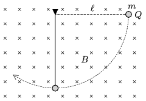

A very thin thread pendulum of length $\ell=0.8$ m is placed in vacuum. The pendulum is also in a region of uniform, horizontal magnetic field of induction $B=2$ T; it is displaced horizontally in the plane which is perpendicular to the induction $\boldsymbol B$, and then released without initial speed, as shown in the figure.

 $a)$ What amount of charge should the pendulum bob of mass $m=0.1$ g be given in order that the tension in the thread when the bob is at the lowermost point of its path is 99% of the value of the tension without magnetic field?
 $b)$ What is the ratio of the values of the tension in the case of two consecutive passes?
 (4 pont)

