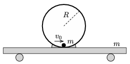

The total mass of the trolley, which has small light wheels, and the ring of radius $R=1$ m on the trolley is $m$ (see the figure ). A small point-like object of mass $m$ is placed to the bottom of the ring. The small object is given an initial speed of $v_0$. What is the value of $v_0$ if the trolley just rises from the ground when the object reaches the topmost point of the ring? Friction is negligible everywhere.

 (5 pont)

