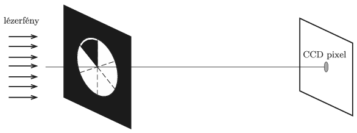

A circular hole on a screen is illuminated by a coherent laser beam perpendicular to the screen. Behind the screen and perpendicular to the optical axis a CCD-detector sheet was placed. By what percent does the illumination of the pixel on the optical axis (the intensity of the incident light beam) decrease if one-sixth of the hole is covered by an opaque sheet having a circular sector shape?

 (5 pont)

