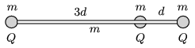

Small metal spheres of mass $m$ were attached to an insulating rod of mass $m$ and of length $4d$. There is another metal sphere (with a hole through it) of mass $m$, at a distance of $d$ from one of the ends of the rod. This sphere can move frictionlessly along the rod. All the three metal spheres are given a charge of $Q$, and the system is released – the system is floating in a space station.

 What will the maximum speed of the sphere in the middle be and how much distance will the spheres move until the maximum speed is reached?
 (4 pont)

