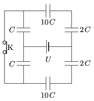

The capacitance of the condensers in the circuit shown in the figure is $C=4~\mu$F. The system is connected to a constant voltage supply of value $U=16$ V.

 $a)$ Calculate the charge of the condensers and the voltage across them.
 $b)$ The switch K is opened. How much charge flows through the voltage supply until the new equilibrium state is reached?
 (4 pont)

