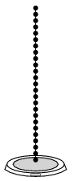

A 50 cm long, 100 g mass chain of small links is hung such that its lower end is just above a scale. Suddenly the chain is released.

 Determine and sketch the reading on the scale as a function of the distance of the top of the chain and the scale; and as a function of the time elapsed from the release of the chain.
 (5 pont)

