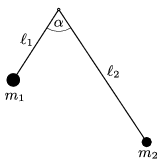

The lengths of two light, rigid rods are $\ell_1$ and $\ell_2$. To one end of each a small object is attached, one having a mass of $m_1$ and the other $m_2$. The other ends of the rods are attached to each other rigidly such that the angle between the rods is $\alpha$. The system is pivoted at the attachment of the rods and can swing freely about a horizontal axis, in a plane determined by the rods. What is the period of the motion of the system when it is displaced a bit from its equilibrium position?

 (5 pont)

