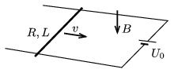

There is a pair of fixed, parallel rails of negligible resistance in a horizontal plane at a distance of $L=10$ cm. The rails are connected at one of their ends to the terminals of a voltage supply of constant voltage of $U_0=0.3$ V, as shown in the figure. The system is in downward magnetic field of magnetic induction of $B=1$ T. A metal rod of resistance $R=0.2~\Omega$ is placed perpendicularly to the rails. The rod can move frictionlessly on the rails.

 What is the magnitude and the direction of the force which is to be exerted on the rod in order that it moves at a constant speed of $v$ in the direction shown in the figure if
 $a)$ $v=1$ m/s;
 $b)$ $v=5$ m/s?
 $c)$ What is the dissipated power of the battery in both cases?
 (5 pont)

