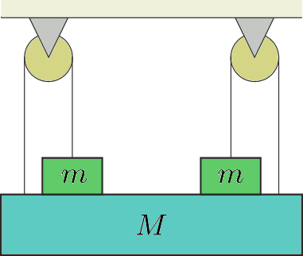

A board of mass $M$ was fixed symmetrically as shown in the figure. The masses of the fixed pulleys and the ropes, as well as friction in the shaft are negligible. (The objects of mass $m$ are not glued to the board of mass $M$.) At what $m/M$ ratio will the system be in equilibrium?

 (3 pont)

