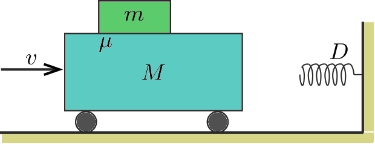

The cart of mass $M$ and the flat block of mass $m$ on the cart are moving at a speed of $v$ towards a compression spring fixed to a wall, and having a spring constant of $D$. The coefficient of friction between the block and the cart is $\mu$. $a)$ Will the block slip or not when the collision occurs? $b)$ How long does the collision last? Data: $M=0.2$ kg, $m=0.1$ kg, $v=1$ m/s, $D=4.4$ N/m, $\mu=0.4$.

 (4 pont)

