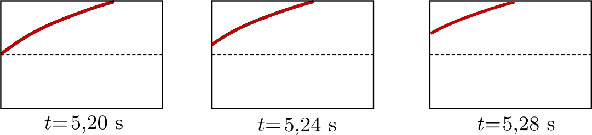

One end of a horizontally stretched rubber thread is moved periodically in the vertical direction, so transverse waves are travelling along the thread. A film is recorded about the motion of a small part of the thread, and three consecutive frames of this film are shown in the figure. In which direction does the energy propagate in the rope, from the left to the right or from the right to the left?

 (6 pont)

