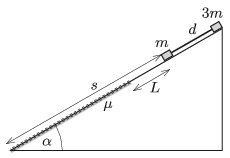

A small object of mass $m=0.5$ kg and another of mass $3m$ are placed to an inclined plane of angle of elevation of $\alpha=30^\circ$. The two small objects are attached with a negligible-mass rigid rod of length $d=50$ cm. The top part of the slope is frictionless, whilst on the bottom part of the slope the coefficient of friction is $\mu=0.2$.

 Initially the object of mass $m$ was at a distance of $L=40$ cm from the boundary of that region where there is friction, and at a distance of $s=120$ cm from the bottom of the plane. The system of the two (point-like) objects is released.
 $a)$ Give the force exerted in the rod as a function of the distance covered.
 $b)$ How long does it take for the object of mass $m$ to reach the bottom of the inclined plane?
 (5 pont)

