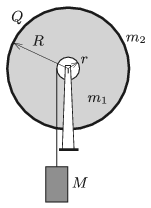

A copper ring of mass $m_2=0{.}05$ kg and of charge $Q=8\cdot10^{-6}$ C is attached to the rim of an insulating disc of mass $m_1=0{.}2$ kg and of radius $R=20$ cm. The disc can be rotated frictionlessly. There is a $M=10$ kg scale weight hanging at the end of a thin thread, which is coiled around a pulley of radius $r=5$ cm on axle of the disc. The scale weight is released at a certain moment without being pushed. Calculate the magnetic induction due to the rotation of the disc at the centre of the disc, $t=3$ s after the release of the scale weight. (The phenomenon of self-induction is negligible.)

 (5 pont)

