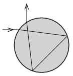

A light ray entering into a spherical water drop emerges from the drop perpendicular to its original direction, after two internal reflections, as shown in the figure. What is the angle of incidence? (The refractive index of water is $n=\frac43$.)

 (5 pont)

