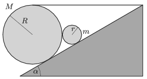

A solid cylinder of mass $M$ and of radius $R$ was placed onto a slope of angle of inclination of $\alpha$. The cylinder is attached to the top end of the inclined plane by means of a horizontal thread as shown in the figure. Next to the object there is another cylinder of mass $m$ and of radius $r$. Friction between the two cylinders is negligible, and the cylinder of mass $M$ is not rising. What is the least value of the coefficient of static friction between the slope and the cylinder of radius $R$ if the cylinders do not slide on the slope?

 Data: $\alpha=30^\circ$, $R=3r$, $M=3m$.
 (5 pont)

