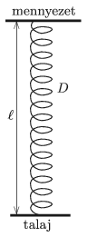

There is a spring of spring constant $D$ and of un-stretched length $d$ in a cave of height $\ell$. The spring is vertical, its mass is negligible and $d<\ell$. One end of the spring is attached to the ceiling and the other is attached to the ground of the cave as shown in the figure.

 A small bat of mass $m$ flies to the midpoint of the spring, clings to the spring, and executes a complicated oscillatory motion driven by the spring. (Not any part of the spring gets loose during the motion of the bat.)
 $a)$ Where will the bat be when the oscillation is ceased? (The spring obeys Hooke's law even in the case of very big extensions.)
 $b)$ From this point the bat carefully climbs up to its original height of $\ell/2$ measured from the ground. What is the least amount of work performed by the bat during its climb?
 (5 pont)

