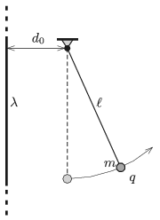

The linear charge density of a vertical very long (``infinitely'' long) straight insulating thread is $\lambda=8\cdot10^{-7}$ C/m. A small metal ball of mass $m=2$ g and of charge $q=7\cdot10^{-8}$ C, is hung by a very thin insulating filament of length $\ell=10$ cm, at a distance of $d_0=5~$cm from the thread. Without any push the ball is released when the filament is vertical.

 $a)$ How far will the metal ball move from the thread?
 $b)$ What is the angle between the vertical and the filament when the ball moves at its maximum speed? What is this maximum speed?
 $c)$ What force is exerted on the support when the ball is moving at its greatest speed?
 (5 pont)

