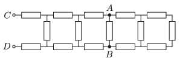

What is the equivalent resistance across points $C$ and $D$ of the resistor system connected as shown in the figure, if each resistor has a resistance of $R$? By what percent does this equivalent resistance across $C$ and $D$ change if the resistor between points $A$ and $B$ is disconnected?

 (4 pont)

