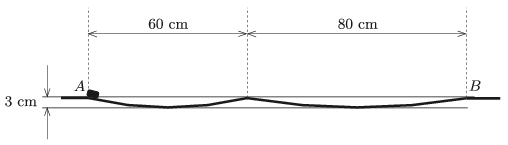

The frictionless trajectory shown in the figure consists of two circular arcs. A tiny object starts to slide from point $A$ along the trajectory with a very small initial speed. How long does it take for the tiny object to reach the right end of the curved path (point $B$)?

 (4 pont)

