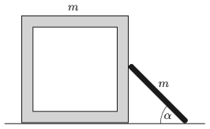

There is a cube-shaped box of mass $m$ on a horizontal floor. A thin, uniform rod of also mass $m$ is leant against one of the faces of the cube touching it at its centre. Initially both of the objects are fixed. The angle between the ground and the rod is $\alpha=45^\circ$.

 What is the initial acceleration of the box at which it starts to move when the objects are released? (Friction is negligible everywhere.)
 (5 pont)

