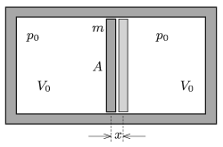

An easily moveable piston of mass $m$ and cross sectional area $A$ is made of a material which poorly conducts heat. The piston divides a horizontal, fixed, and thermally insulated cylinder into two parts, having the same volume of $V_{0}$. There is the same amount of helium gas in the two parts, at the pressure of $p_{0}$.

 The piston is displaced a bit, and then released. What is the period of the resulting oscillation?
 (5 pont)

