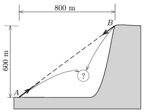

Two cannons fire a ball at the same time towards each other from points $A$ and $B$ as shown in the figure. The nozzle speed of the ball fired from the cannon at $A$ is 40 m/s, whilst the nozzle speed of the ball fired from the cannon at $B$ is 60 m/s. Do the two balls collide? If yes, where and when? If not, where do the balls hit the ground?

 (4 pont)

