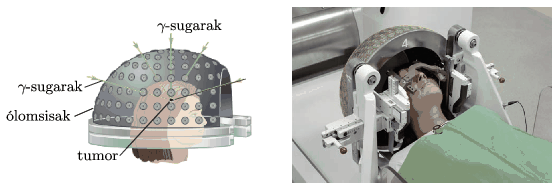

When radiotherapy is applied, the tumour is exposed to a certain dose (absorbed energy per unit mass) of radiation, such that the surrounding healthy tissues do not absorb a too large dose. Investigate this problem by using the following simple model: the patient's head is considered to be a uniform sphere of radius 8 cm. The small tumour is located at the centre of the sphere and is radiated by beams of $\gamma$ photons, having the same intensity. The radiation beams are aimed from the direction of five different diameters. The intensity (power per unit area) of the radiation beam is decreasing exponentially as the beam passes the tissues in the sphere, in accordance with the following equation: $I(x)=I_0{\rm e}^{-\mu
x}$.(The distance of $x_0=\ln 2/\mu$ is called the half-value layer ; its numerical value depends on the energy of the photons and the material of the absorbing medium. E.g. for photons of energy 2.5 MeV it is $x_0=23$ cm in water.)

 Two different types of radiation can be applied: either $\gamma$-photons of energy 1 MeV emitted by a source of $^{60}\rm Co$, for which $\mu=0.07~\rm cm^{-1}$, or $\gamma$-photons of energy 6 MeV, which can be generated by a particle accelerator, here $\mu=0.028~\rm cm^{-1}$.
 Which radiation spares more the healthy tissues, that is, which one results a smaller dose at the surface of the sphere? What is the value of the dose next to the surface of the sphere if the necessary dose value at the tumour is $D$?
 (5 pont)

