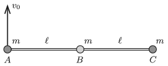

Three small alike balls (denoted by the letters $A$, $B$ and $C$) of mass $m$ are attached by means of two negligible-mass rods of length $\ell$, such that one of the rods joins balls $A$ and $B$, whilst the other joins balls $B$ and $C$. At ball $B$ there is an articulate joint so the angle between the rods can be freely varied. The system is at rest in weightlessness, and the three balls are collinear. Then at an instant an initial velocity of $v_0$ is given to ball $A$ perpendicularly to the rods. What are the forces in the rods at the moment right after starting ball $A$?

 (6 pont)

