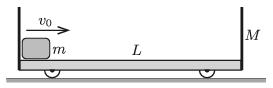

There is a small object of mass $m=0{.}25~$kg at the left end of a trolley of mass $M=1~$kg and of length $L=0.3~$m. The trolley has vertical walls at its sides, and moves frictionlessly along the horizontal plane. Its small wheels are of negligible mass and size.

 At a given instant the small object of mass $m$ is given an initial speed of $v_0=1~$m/s towards the right. The coefficient of friction between the trolley and the object is $\mu=0.1$. The collision between the object and the trolley can be considered elastic.
 $a)$ What is the speed of the trolley, when the object of mass $m$ on it does not move with respect to the trolley?
 $b)$ How far is the object of mass $m$ from the left wall of the trolley in the above asked case?
 $c)$ What are the velocities of the objects right after the moment of the first collision?
 (5 pont)

