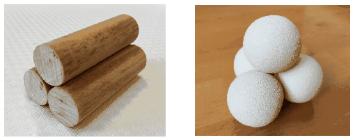

$a)$ Two alike solid cylinders are placed to the level tabletop next to each other and then carefully a third similar cylinder is placed to the top of the other two. What are the least values of the coefficient of static friction between the cylinders and between a cylinder and the table so that the arrangement stays at rest?
 $b)$ Three alike solid spheres are placed to the level tabletop next to each other and then carefully a fourth similar sphere is placed to the top of the other three. What are the least values of the coefficient of static friction between the spheres and between a sphere and the table so that the arrangement stays at rest?

 (5 pont)

