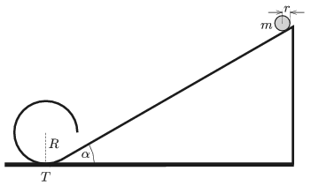

A slope of angle of elevation of $\alpha =30^\circ$ is followed by a cylindrical surface of radius $R=32~$cm as shown in the figure. The cross section of the cylinder is three-quarters of a circular path started at the lowermost point of the circle $T$, and the tangent to the circle at point $T$ is in the plane of the slope. A uniform solid disc of mass $m$ and of radius $r$ is released without any initial speed from the plane. (Static friction is big enough everywhere, so the disc rolls down the slope without sliding. Rolling friction is negligible. The cylindrical surface is ideally smooth.)

 $a)$ What is the radius of the disc if it just passes the gap below the cylinder?
 $b)$ What is the least height, measured from the ground, from which the disc should be released in order that it arrive back to the slope at a vertical velocity?
 $c)$ In this case what is the speed of the disc when it reaches the slope?
 (5 pont)

