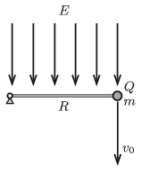

One end of a very thin negligible-mass rod of length $R=0{.}64~\rm m$ is attached to a horizontal axle, whilst to its other end a small sphere of mass $m=5$ g and of charge $Q=6\cdot10^{-7}$ C is fixed. The whole structure is placed into vertically downward uniform electric field of strength $E=2\cdot10^5$ V/m. The rod is put into the horizontal position shown in the figure.

 $a)$ What vertically downward initial speed $v_0$ should the small sphere be given in order that after 3/4 of a complete revolution the rod gets stuck, and at the same time the small sphere is ceased to be fixed to the rod, and flies back exactly to its initial position?
 $b)$ What is the angle between the velocity of the small sphere and the horizontal, when the sphere passes its initial position?
 $c)$ What is the ratio of the speed of the sphere when it passes its initial position to that of its initial value?
 (5 pont)

