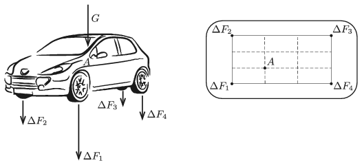

The centre of mass of the driver of weight $G=840$ N, when he is sitting in the car, is at point $A$ as shown in the figure. (The scale figure on the right shows the top view of the car. Point $A$ is the first left trisecting point of the rectangle determined by the wheels of the car.)

 By what amount are the magnitudes of the forces exerted on the wheels of the car increased when the driver is sitting in the car compared to the case when he is not in the car? The springs at the wheels are alike and they all obey Hooke's law.
 (5 pont)

