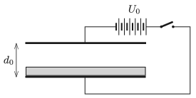

The plates of a parallel-plate condenser shown in the figure are horizontal and they are at a distance of $d_0=4$ cm from each other. The condenser is in vacuum. An aluminium sheet of width $d_0/4$ is placed on the lower plate, and high voltage is connected to the condenser.
 $a)$ What should the value of $U_0$ be in order that the sheet rise?
 $b)$ At a given applied voltage of $U$ what is the width of the aluminium sheet that can rise from the lower plate of the condenser of plate distance $d_0$?
 $c)$ Is there a voltage value at which the sheet surely rises, independently of the width of the sheet (provided that it is less than $d_0$)?
 (Assume that the aluminium sheet remains horizontal all the time. The sides of the condenser plates are much greater than $d_0$, and wind effects are negligible.)

 (5 pont)

