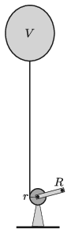

An air-plane day is organised at Pécs-Pogány airport. For advertisement purposes a helium-filled balloon of volume $V=10~\rm m^3$ is launched. The balloon is tethered by a piece of rope of negligible mass. The volume of the fabric of the envelope is negligible, its mass, without the inside gas, is $m=2~\rm kg$. The temperature inside the envelope, and outside, next to the balloon is $T=300~$K, whilst the ambient air pressure is $p_0=10^5$ Pa. The pressure due to the elasticity of the fabric of the envelope can be neglected.

 At the end of the event the balloon is slowly winched down. The radius of the drum of the winch is $r=10$ cm, whilst the radius of the crank is $R=30$ cm. Air drag is negligible.
 $a)$ What is the magnitude of the force applied on the crank, if the balloon is pulled down uniformly?
 $b)$ What is the power output when the balloon is winched down, if the balloon descends at a speed of $v=1$ m/s?
 (4 pont)

