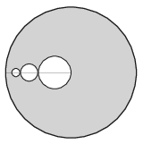

Circles, which touch each other externally and whose centres are on the same radius of a uniform-density disc of unit radius, are cut out from the disc as shown in the figure.

 The radii of the circles which are cut out are $\frac14, \frac18, \frac1{16}, \ldots\,.$ Where is the centre of mass of the remaining part of the disc if
 $a)$ only the greatest circle,
 $b)$ the two greatest circles,
 $c)$ a lot of circles are cut out from the disc?
 (5 pont)

