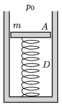

In a closed cylinder there is a sample of helium gas of volume 4 dm${}^3$. The base area of the cylinder is 7 dm${}^2$ and the cylinder is closed with a 5 kg piston. The piston and the bottom of the cylinder is connected with a vertical, initially unstretched spring of spring constant 400 N/m.

 How much heat should be added in order that the piston rise by 5 cm? (The external pressure is 100 kPa, and the system is thermally insulated.)
 (4 pont)

