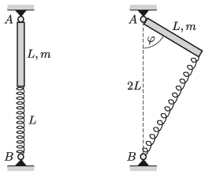

One end of a uniform-density rod of mass $m=0.4$ kg and of length $L=20$ cm is attached to a hinge at point $A$, as shown in the left figure, about which it can be rotated in any direction. The other end of the rod is attached to a vertical spring of spring constant $D=25$ N/m, which also has a length of $L$ when there is no force exerted on it. Initially the spring and the rod are in the same line. Then the rod is displaced (as it is shown in the right figure ) by an angle of $\varphi=60^\circ$, and then it is released.

 $a)$ What is the speed of the end of the rod when it passes the vertical position?
 $b)$ The rod is displaced from the equilibrium position by a small angle, and then it is released. How long does it take for the rod to reach the vertical position?
 $c)$ By what angular speed should the spring-rod system be rotated about the vertical axis $AB$ in order that the angle between the rod and the vertical be constantly $60^\circ$?
 (Friction is negligible everywhere.)
 (5 pont)

