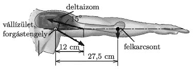

A student is standing with horizontally stretched arms. The mass of his arm is 3 kg, and the centre of mass of the arm is exactly at the elbow of the student, which is at a distance of 27.5 cm from the joint at the shoulder of the student about which the arm can be turned, as it is shown in the figure. The force exerted in the deltoid muscle of the student encloses an angle of $15^\circ$ with the horizontal, and its point of application is at a distance of 12 cm from the joint in the shoulder. Using calculation or classical construction, determine the force exerted by the deltoid muscle of the student.

 (4 pont)

