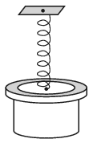

A 500 g object is attached to a vertical compression-expansion spring of spring constant 400 N/m. On the object – next to the attachment of the spring – there is a 100 g metal ring at rest. The object and the ring is suddenly given an initial downward speed of $v_0$. During their motion together, when their acceleration is the greatest, the apparent weight of the ring becomes three times as much as its original weight was. How much time elapses from the beginning of their motion until the ring becomes weightless?

 (4 pont)

