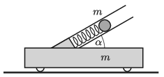

There is a spring gun of negligible mass fixed at an angle of $\alpha = 30^\circ$ to a cart of mass $m$ on the horizontal ground. The spring gun shoots a bullet in two cases. In the first case the cart can move freely, whilst in the other the cart is fixed. The vertical displacement of the bullet in the first case is $h_1$, and in the second case it is $h_2$. Determine the ratio $h_2/h_1$.

 (5 pont)

