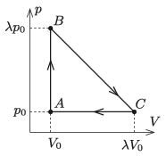

A sample of monatomic ideal gas is taken through the cyclic process $ABCA$ shown in the figure. What is the efficiency of the cyclic process if the highest temperature of the gas (measured in kelvins) is nine times as big as the lowest temperature of the gas?

 (5 pont)

