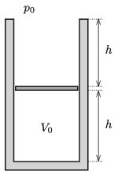

There is a thin negligible-mass piston at exactly the middle of the height of a container which is open at its top and is shown in the figure. The volume of the enclosed air is $V_0$, and the atmospheric pressure is 76 cmHg. Slowly mercury is poured to the piston, until the level of the mercury reaches the rim of the container. How much does the piston move? (The container and the piston are thermal insulators; and we have $h=38$ cm.)

 (4 pont)

