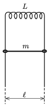

A coil of inductance $L$ is connected to the top ends of a vertical pair of rails shown in the figure. The distance between the rails is $\ell$. A small rod of mass $m$ and of negligible resistance can move along the rails without friction. The external magnetic field $\boldsymbol
B$ is horizontal and perpendicular to the plane of the rails.

 Releasing the rod
 $a)$ at most what is the induced electromotive force in the coil;
 $b)$ and at most what is the induced current?
 (5 pont)

