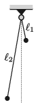

Two simple pendulums are fixed at the same height. They swing in parallel planes close to each other. One of them is $\ell_1=25$ cm, whilst the other is $\ell_2=1.2$ m long. The two pendulums are displaced in the opposite direction at the same small angle, and then released.

 $a)$ How long does it take for the pendulums to go past each other after they were released?
 $b)$ How much time elapses until they meet again?
 $c)$ What should the ratio of the lengths of the pendulums be in order that the fifth encounter be the first one when the direction of the velocities of the two pendulum bobs is the same?
 (5 pont)

