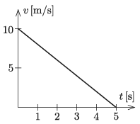

A cuboid-shaped prism is sliding along a horizontal surface in a straight line and is decelerating due to friction. The figure shows the velocity-time graph of its motion.

 A spring-loaded toy cannon is attached to the top of the prism, which fires projectiles of mass $m$ at a speed of $v_0$, during the slowing motion of the prism. The total mass of the prism and the toy cannon is $M$.
 $a)$ To which direction should the cannon be aimed in order that the projection not affect the decelerating motion of the prism, or in other words the graph of the motion of the cannon continue in the same way after firing the projectile?
 $b)$ If the angle between the gun barrel and the horizontal is adjusted to half of the angle determined in the previous problem, then how does this affect the graph of the deceleration? Sketch the modified velocity-time graph of the motion, if the projectile was shot at $t=2$ s.
 Data: $m=0.1$ kg, $M=1$ kg, $v_0=5$ m/s.
 (5 pont)

