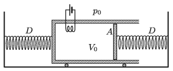

The figure shows a piston and two springs attached to it. The spring constant of both springs is $D=1000$ N/m, the ambient air pressure is $p_0=10^5$ Pa, and the piston of cross-sectional area $A=10~{\rm dm}^2$ encloses a sample of monatomic gas. Initially both springs are unstretched, and the volume of the gas is $V_0=50$ litres. How much does the piston move, if $Q=2~\rm kJ$ thermal energy is added to the sample of gas? (The walls of the container and the piston are thermally insulated; friction, and the heat capacity of the heating element are negligible.)

 (4 pont)

