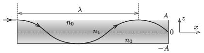

The refractive index of a transparent glass sheet of width $2A$ varies in the direction of axis $z$, which is perpendicular to the plane of the sheet. At $z=\pm A$ its value is $n_0$, whilst at $z=0$ it is $n_1$. A thin ray of laser enters into the glass (at a ``height of'' $z= A$) and travels in the direction of axis $x$. The laser beam is deflected in the glass and travels along the curved path of a cosine function.

 $a)$ How does the refractive index depend on $z$?
 $b)$ What is the wavelength of the path of the laser?
 Data: $A=1$ cm, $n_0=1.5$ and $n_1=1.6$.
 (5 pont)

