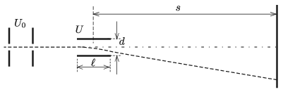

Determine the sensitivity of the cathode-ray oscilloscope shown in the figure in the unit of mm/volt.

 Data: the length of the deflecting plates is $\ell=2$ cm, their distance is $d= 0.5$ cm, the distance between the screen and the centre of the plates is $s=20$ cm, the accelerating voltage is $U_0=1000$ V, and the greatest value of the deflecting voltage is $U_\text{max}=100$ V.
 (4 pont)

