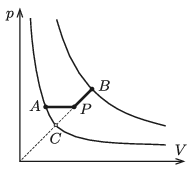

A sample of monatomic ideal gas of $n=2$ moles is taken through the process $A\to P\to B$ shown in the figure. The temperature of the gas in the initial state is $T_1=280$ K, and in the final state $T_2=4T_1$. Line segment $AP$ is parallel to axis $V$, the extension of line segment $BC$ passes through the origin, and point $P$ is the midpoint of the line segment $BC$.

 $a)$ Determine the temperature of the gas at state $P$.
 $b)$ How much heat is absorbed by the gas during process $A\to P\to B$?
 (5 pont)

