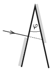

A beam of light falls perpendicularly to one side of a glass prism, and it cannot exit at the top part of the other side of the prism, because that part is coated with some reflective material. Below the point of entry the first side of the prism was also coated with a reflective material, so that light cannot escape from the glass in this part either, but is reflected. Finally, the light beam exits the prism on the other side such that its direction of travel is deviated by $40^\circ$ with respect to the direction of the light beam entering into the prism. What is the angle of the prism $\varphi$ if the refractive index of its material is 1.5?

 (4 pont)

