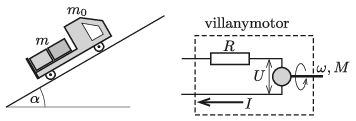

An electric toy car with a mass of $m_0$, and with a load of mass $m$ on it, moves upwards at a constant speed along a slope of elevation angle of $\alpha$. The electric motor, which drives the wheels of radius $r$, can be modelled, when it operates in a steady rate, with a resistor of resistance $R$ which is connected in series with a circuit element, whose voltage $U$ is proportional to the angular velocity of the axle $\omega$ ($U=\gamma \omega$). The current $I$ that flows through it is proportional to the torque $M$ exerted by the axles $(I=M/\gamma)$. The toy car is powered by a battery of e.m.f. $U_0$ and internal resistance of $R_{\mathrm{b}}$.

 Data: $m=300$ g, $\alpha=30^\circ$, $r=2$ cm, $\gamma=1.2$ Vs, $U_0=4{,}5$ V, $R=0{,}8~\Omega$ , $R_\text{b}=1.2~\Omega$. (The coefficient of static friction between the wheels and the slope is high enough, so the car does not slip.)
 $a)$ At what constant speed does the toy car travel if the mass of the load on it is $m=600$ g?
 $b)$ At what load of $m$ will efficiency of the transport of the load be the best? (Efficiency is the ratio of the energy used to lift the load to the energy delivered by the battery.)
 (5 pont)

