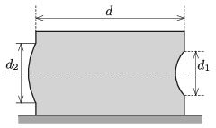

On each of the opposite faces of a rectangular aquarium there is a circular hole covered by a thin spherical cap-shaped piece of glass, as shown in the figure. The common principal axis of the caps is horizontal. The radius of curvature of the concave cap – the one depressed into the aquarium – is $r$, and that of the convex cap – bulging outward from the aquarium – is $2r$. The topmost points of both caps are below the surface of the water in the aquarium. The refractive index of water is $n=4/3$. (The angle between the principal axis of the spherical glass cap, and the radius drawn from the centre of the sphere to a point on the perimeter of the circular base of the cap is small.)

 $a)$ What is the distance between the two faces of the aquarium, containing the glass caps, if a parallel beam of light entering horizontally to one of the spherical caps emerges from the other glass cap as a parallel and horizontal beam of light?
 $b)$ What is the ratio of the diameters of the two spherical caps $d_2$ to $d_1$, if a horizontal light beam entering the aquarium through any of the spherical caps exits entirely through the other spherical glass cap?
 $c)$ There is a tiny fish at the common principal axis in the middle of the aquarium. Where can this fish be observed, when viewed through one of the glass caps on one side, then through the other?
 (5 pont)

