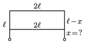

A wire of length $4\ell$ was bent at right angles at its two quadrisecting points, next to the ends of the wire. Where should another piece of $2\ell$-long wire of the same type be connected to the first wire, if the equivalent resistance of the wire system is to be the same as the resistance of the wire of length $2\ell$?

 (4 pont)

